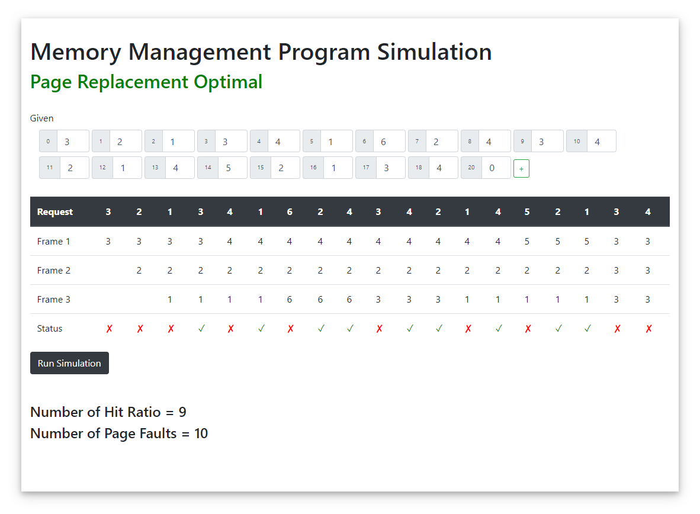

# Memory Management Program Simulation  
## Page Replacement Optimal  
  
  
  
<blockquote className="blockquote text-right">  
	
<a href="https://www.youtube.com/watch?v=DXU7SqsYDvg&t=821s">Page Replacement Algorithms | LRU and optimal | Operating Systems</a>
   
	<footer className="blockquote-footer">Credits to <cite title="Source Title">Jenny's lectures CS/IT NET&JRF</cite></footer>  
</blockquote>  
 
  
